## Pipeline Architecture
***This is the invetigation flow: Work in progress***
### Legend

- Purple nodes — LLM calls (GPT-4o-mini or GPT-4o) with cost per call
- Dark nodes — Pure Python, no LLM, no cost
- Orange node — Conditional router that branches based on failure class
- Green nodes — Evidence collection paths (targeted SQL checks)
- Blue triggers/outputs — Entry points and final deliverables
- Dotted line — The feedback loop where stored incidents feed back into future investigations

```mermaid

graph TD
    %% ── Trigger Layer ──
    A1[/"🔔 Airflow Failure Callback<br/>(automatic)"/] --> B
    A2[/"⌨️ CLI: --dag-id --task-id --run-id<br/>(manual trigger)"/] --> B
    A3[/"❓ CLI: --question 'Why are sales missing?'<br/>(free-form question)"/] --> B

    %% ── Intake ──
    B["<b>Node 1: Intake / Normalizer</b><br/>Generate incident_id<br/>Normalize trigger payload<br/>Resolve task → dbt model mapping<br/><i>Pure Python, no LLM</i>"]
    B --> C

    %% ── Context Collection ──
    C["<b>Node 2: Context Collector</b><br/><i>Pure Python, no LLM</i>"]
    C --> C1["📋 Airflow Connector<br/>Fetch task logs (last 50 lines + errors)<br/>Fetch task metadata, retries, status"]
    C --> C2["📦 dbt Connector<br/>Parse manifest.json<br/>Parse run_results.json<br/>Read model SQL file"]
    C --> C3["🗄️ Postgres Connector<br/>Query INFORMATION_SCHEMA<br/>Get table/column metadata"]
    C --> C4["🔗 Lineage Extractor<br/>Read dbt depends_on graph<br/>Map upstream/downstream"]
    C1 --> D
    C2 --> D
    C3 --> D
    C4 --> D

    %% ── Signal Extraction ──
    D["<b>Node 3: Signal Extractor</b><br/>Truncate logs via token budget<br/>LLM extracts: error type, objects,<br/>SQL error codes, warnings<br/>Merge with regex patterns<br/><i>GPT-4o-mini (~$0.001)</i>"]
    D --> E

    %% ── Classification ──
    E["<b>Node 4: Failure Classifier</b><br/>Few-shot classification prompt<br/>Output: failure class + confidence<br/>+ investigation priorities<br/><i>GPT-4o-mini (~$0.001)</i>"]
    E --> F

    %% ── Conditional Router ──
    F{"<b>Node 5: Conditional Router</b><br/><i>Pure Python, no LLM</i><br/>Routes based on failure_class"}
    F -->|data_quality| G1
    F -->|schema_drift| G2
    F -->|code_failure| G3
    F -->|dependency| G4
    F -->|silent_correctness| G5
    F -->|access / resource| G6

    %% ── Evidence Paths ──
    G1["🔍 Data Quality Path<br/>• Null count check<br/>• Duplicate key check<br/>• Row count check<br/>• Freshness check<br/>• Sample suspicious rows"]
    G2["🔍 Schema Drift Path<br/>• Column presence check<br/>• Data type comparison<br/>• Constraint check<br/>• Schema snapshot diff"]
    G3["🔍 Code Failure Path<br/>• Invalid cast check<br/>• Sample bad values<br/>• Model reference validation"]
    G4["🔍 Dependency Path<br/>• Partition presence check<br/>• Row count check<br/>• Freshness check<br/>• Upstream task status"]
    G5["🔍 Silent Correctness Path<br/>• Row count check<br/>• Null count check<br/>• Duplicate check<br/>• Metric comparison"]
    G6["🔍 Access / Resource Path<br/>• Permission check<br/>• Config validation<br/>• Resource metrics"]

    G1 --> H
    G2 --> H
    G3 --> H
    G4 --> H
    G5 --> H
    G6 --> H

    %% ── Database Evidence ──
    H["<b>Node 6: Database Evidence Analyzer</b><br/>Execute parameterized SQL templates<br/>against target tables/columns<br/>Format results as structured evidence<br/><i>Pure Python, no LLM</i>"]
    H --> I

    %% ── Code Inspector ──
    I["<b>Node 7: Code Inspector</b><br/>Send model SQL + evidence context<br/>Identify: bad joins, missing filters,<br/>risky casts, broken refs<br/>Output: findings with SQL line refs<br/><i>GPT-4o (~$0.01)</i>"]
    I --> J

    %% ── Lineage Tracer ──
    J["<b>Node 8: Lineage Tracer</b><br/>Traverse dbt depends_on<br/>Identify upstream sources<br/>Identify downstream impact<br/>Check one level upstream if needed<br/><i>Pure Python, no LLM</i>"]
    J --> K

    %% ── Incident Retrieval ──
    K["<b>Node 9: Incident Retriever</b><br/>Embed current incident summary<br/>(text-embedding-3-small)<br/>Query pgvector for top 3 similar<br/>Filter by failure_class if available<br/>Return: past root causes + fixes<br/><i>~$0.00004</i>"]
    K --> L

    %% ── Root Cause Reasoning ──
    L["<b>Node 10: Root Cause Reasoner</b><br/>Receives ALL evidence:<br/>signals + classification + DB evidence<br/>+ code findings + lineage + similar incidents<br/>Chain-of-thought reasoning<br/>Output: root cause + evidence chain<br/>+ confidence + alternatives considered<br/><i>GPT-4o (~$0.02)</i>"]
    L --> M

    %% ── Fix Generator ──
    M["<b>Node 11: Fix Generator</b><br/>Output three categories:<br/>1. Immediate fix (specific, actionable)<br/>2. Preventive fix (tests, guardrails)<br/>3. Monitoring recommendation (alerts)<br/><i>GPT-4o (~$0.01)</i>"]
    M --> N

    %% ── Response Formatter ──
    N["<b>Node 12: Response Formatter</b><br/>Assemble structured JSON report<br/>Auto-store in incidents table<br/>Generate embedding for future retrieval<br/><i>Pure Python, no LLM</i>"]
    N --> O1
    N --> O2
    N --> O3

    %% ── Outputs ──
    O1[/"📊 CLI Streaming Display<br/>(real-time investigation steps<br/>+ formatted final report)"/]
    O2[/"💾 Incident DB Storage<br/>(investigator_db + pgvector embedding<br/>for future retrieval)"/]
    O3[/"📄 JSON Report File<br/>(structured output for<br/>programmatic access)"/]

    %% ── Feedback Loop ──
    O2 -.->|"Future investigations<br/>retrieve similar incidents"| K

    %% ── Styling ──
    classDef trigger fill:#4A90D9,stroke:#2E6EB0,color:#fff,stroke-width:2px
    classDef node fill:#2C3E50,stroke:#1A252F,color:#fff,stroke-width:2px
    classDef llmNode fill:#8E44AD,stroke:#6C3483,color:#fff,stroke-width:2px
    classDef router fill:#E67E22,stroke:#D35400,color:#fff,stroke-width:2px
    classDef evidence fill:#27AE60,stroke:#1E8449,color:#fff,stroke-width:2px
    classDef output fill:#2980B9,stroke:#1F618D,color:#fff,stroke-width:2px
    classDef connector fill:#5D6D7E,stroke:#4A5568,color:#fff,stroke-width:1px

    class A1,A2,A3 trigger
    class B,C,H,J,N node
    class D,E,I,L,M llmNode
    class F router
    class G1,G2,G3,G4,G5,G6 evidence
    class O1,O2,O3 output
    class C1,C2,C3,C4 connector

```

## Added graph, node, and agent files

- graph.py
    - Contains the LangGraph workflow
- node.py
    - Contains the nodes for the LangGraph workflow
- agent.py
    - Contains the agent for the LangGraph workflow

## Testing

-  Added all 12 nodes to the graph and compiled it.

- test_graph_full.py
    - Tests the full LangGraph workflow
- All test cases are passing.